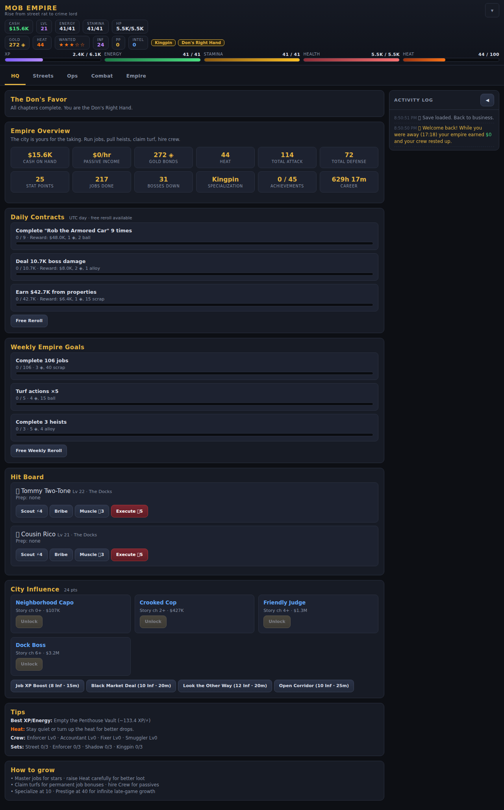
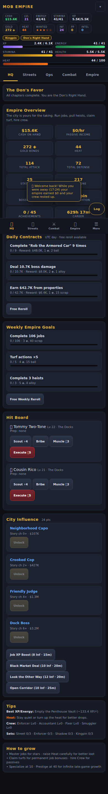
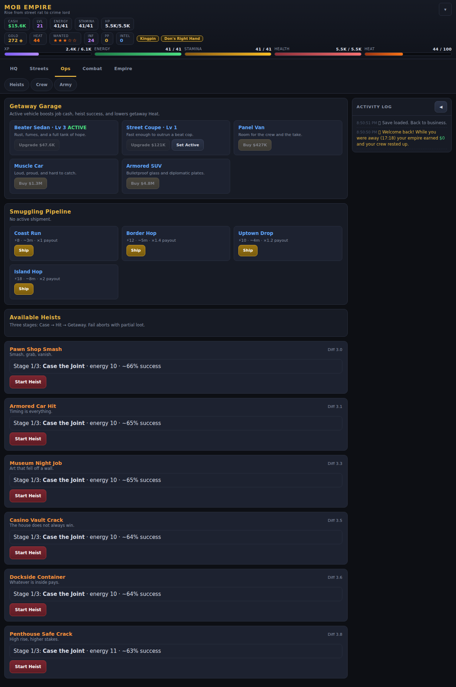
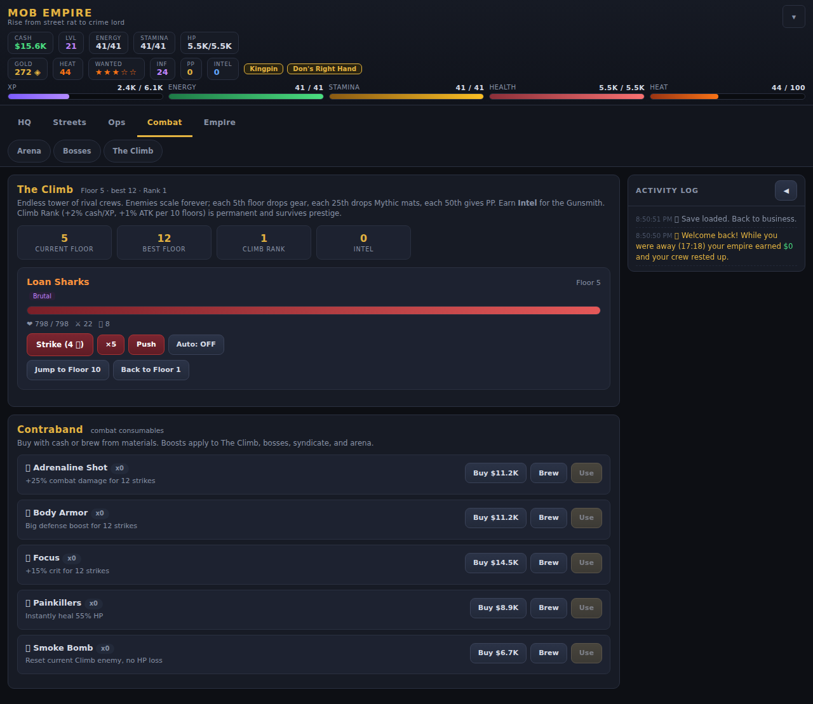
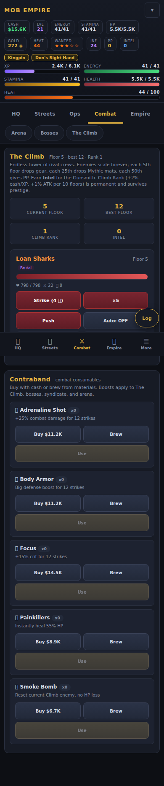
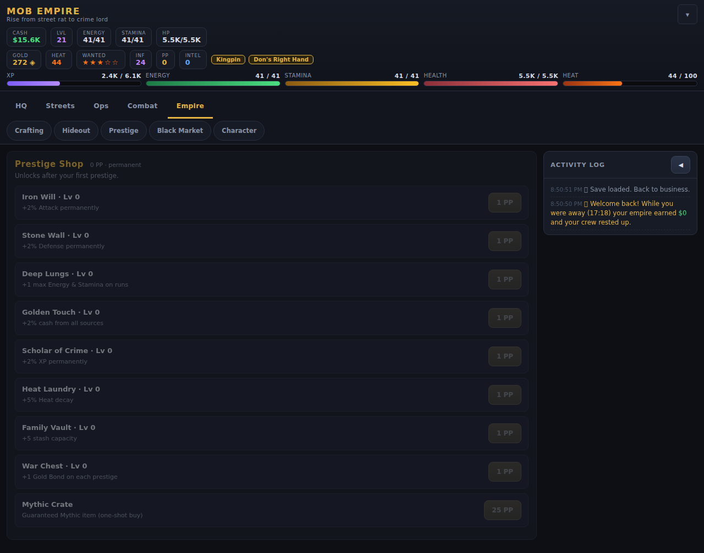

# Mob Empire

A single-player, browser-based crime RPG inspired by classic social games like Mafia Wars — rebuilt as a deep solo experience with infinite progression and zero multiplayer dependencies.

## Screenshots

**Dashboard** — stats, jobs, and grouped nav on desktop:



**Mobile** — bottom nav, compact header, and touch-friendly layout:



**Heists** — Case → Hit → Getaway with cooldowns and loot:



**The Climb** — infinite PVE tower with enemy affixes and Intel rewards:





**Prestige Shop** — permanent upgrades after your first Rebuild:



## Play

```bash
python3 serve.py
```

Serving over HTTP is recommended because the game logic now loads from an external file. Stop a running server with `python3 serve.py --stop`.

The project is split for maintainability:

- `index.html` — markup plus a tiny inline load-failure helper.
- `styles.css` — all styling.
- `game.js` — all game logic (a classic script; inline handlers stay global).

Opening `index.html` directly via `file://` may be blocked by the browser from loading `game.js`; use the local server instead.

Progress auto-saves to `localStorage` (save format **v6**; older saves migrate automatically). Passive property income and resource regeneration accrue while the tab is closed (banked up to 8 hours).

## UI / mobile

The interface uses **grouped navigation** (HQ, Streets, Ops, Combat, Empire) with sub-tabs on desktop and a **bottom nav bar** on phones/tablets (under 980px). Tap **More** to reach any section. The header can be collapsed with the **▾** toggle; the activity log collapses on desktop (◀) or opens via the floating **Log** button on mobile.

## Dev / UI audit

Uses a **Python venv** (no sudo). Playwright browsers install to your user cache.
On minimal Linux/WSL, shared libraries are fetched via `apt download` into `.local-libs/`.

```bash
bash scripts/setup_dev.sh          # .venv + pip + playwright + browser libs
source .venv/bin/activate
python scripts/seed_test_save.py   # mid-game save for audits
python scripts/ui_smoke.py         # headless nav/render check (no browser)
python3 serve.py --no-open
python scripts/run_ui_audit.py     # screenshots: all 14 tabs × desktop + mobile
```

Screenshots land in `tests/screenshots/{desktop|mobile}/`.

If bundled Chromium still fails, use system Chrome:

```bash
PLAYWRIGHT_CHANNEL=chrome python scripts/run_ui_audit.py
```

Optional Node smoke (no venv): `node scripts/ui-smoke.js`. Legacy npm Playwright: `npm run test:ui`.

## Systems

- **Infinite progression** — exponential scaling (~22%/level), no level cap.
- **Job Mastery** — stars, cash/XP/drop bonuses, 5★ material drip.
- **Heat, Wanted & Jail** — risk/reward with raids, Wanted stars, and lockup.
- **Heists** (L8+) — Case → Hit → Getaway with cooldowns and Rare+ loot.
- **Vehicles** — getaway cars boosting jobs, heists, and Heat.
- **Smuggling Pipeline** — vehicle + energy routes with ETA and risk rolls.
- **Turf Wars** — claim/defend for up to +25% job rewards.
- **Property Rackets** — timed interactive income events.
- **Hideout** — Armory, Laundry, Gym, War Room (persists through prestige).
- **Underground Arena** (L6+) — stamina fight ladder with streaks and tokens.
- **Hit Board** (L10+) — assassination contracts with Scout/Bribe/Muscle prep.
- **City Influence** — unlock contacts and spend Influence on timed city buffs.
- **Collections** — relic token sets with permanent tiny bonuses.
- **Capo Talent Tree** (L12+) — Violence / Business / Ghost branches.
- **Gear Sets** — Street / Enforcer / Shadow / Kingpin 2pc/3pc bonuses.
- **Crew** — Enforcer, Accountant, Fixer, Smuggler.
- **Army** (L20+) — endgame flat-stat recruits (persists through prestige).
- **Prestige Shop** — permanent PP upgrades after first Rebuild (Iron Will, Mythic Crate, and more).
- **Syndicate Wars** — prestige-scaled weekly campaign bosses (PP + Mythic shards/drops).
- **Mythic gear** — rarity above Legendary via wars, craft, or Prestige Shop crate.
- **The Climb** — infinite PVE tower of rival crews; floors scale forever, drop gear/Mythic mats/PP at milestones, and pay **Intel**.
- **Enemy Affixes** — Climb floors roll modifiers (Armored, Brutal, Regenerating, Evasive, Vampiric, Made Man).
- **Contraband** — combat consumables (Adrenaline, Body Armor, Focus, Painkillers, Smoke Bomb) bought or brewed, used in Climb/boss/syndicate/arena.
- **Gunsmith** — spend Intel + mats to Reforge or Enchant equipped gear with bonus mods.
- **Climb Ranks** — permanent +2% cash/XP and +1% ATK per 10 best floors (survives prestige).
- **Daily & Weekly goals** · **Don's Favor** story · **Specialization** · **Prestige**.
- **Loot & crafting** · **Bosses** · **Black Market**.
